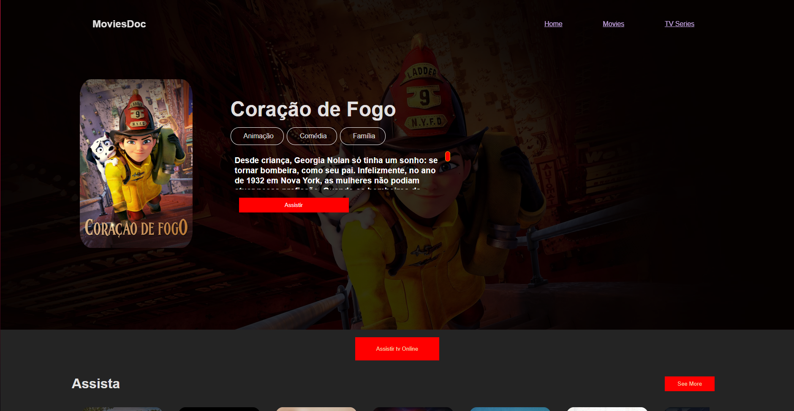

## Olá, sou Stênio Sousa, Estagiário de DevOps e Graduando em Ciência da computação 👋

#### SOBRE MIM
Moro no Ceará, sou apaixonado por programação e por conversa cabeça, 
atualmente tenho como projeto principal MovieCity, uma plataforma de stream

## Tecnologias que ultilizei

  Me aprofundei em consumir todo o poder que React me proporciona:
  {(Hooks do react; React Router Dom) =>  ate o momento()}
  Os conteúdos de mídia são consumidor de uma API;

